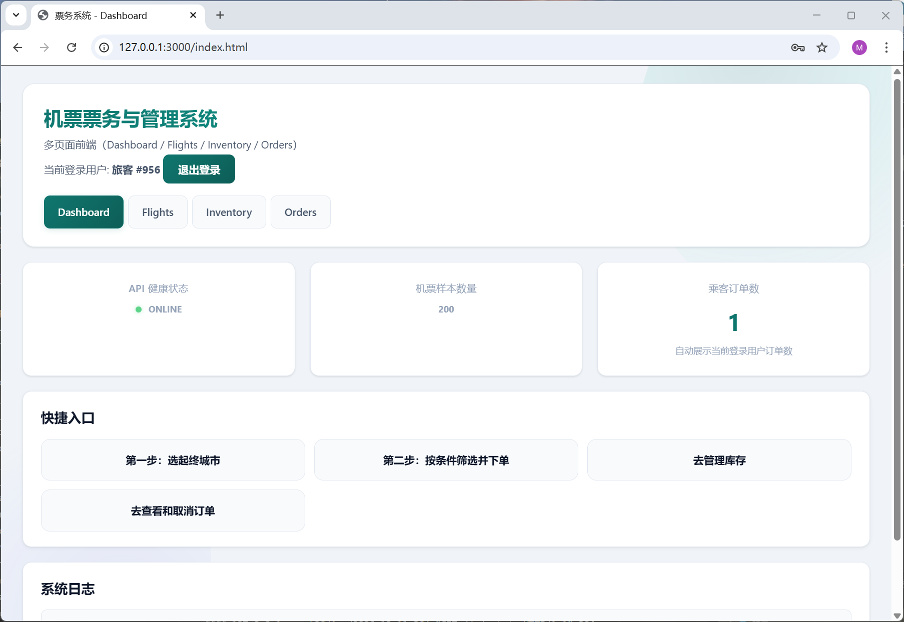

# CS307 Spring 2026 — Database Project Part 1 Report

---

## Basic Information of the Group

| Field | Member 1 | Member 2 |
|-------|----------|----------|
| **Name** | *马奕铭* | *李明龙* |
| **Student ID** | *12410614* | *12411830* |
| **Lab Session** | *Mon7,8* | *Mon7,8* |

### Contribution Breakdown

| Task / Part | Member 1  | Member 2  |
|---|---|---|
| Task 1 – E-R Diagram (`er_diagram.mmd`) | - | √ |
| Task 2 – Database Design (`schema.sql`) | √ | - |
| Task 3.1 – Import scripts (`import_data.py`) | √ | - |
| Task 3.2 – Accuracy SQL (`task3_accuracy_queries.sql`) | √ | - |
| Task 4 – CRUD CLI (`cli.py`) | - | √ |


---

## Task 1: E-R Diagram (20 %)

### Diagramming tool
draw.io
### E-R Diagram


### Entity and Relationship Overview

| Entity | Key Attributes | Role |
|--------|---------------|------|
| REGION | `region_code` (PK), `region_name` | Geographic region for cities and airlines |
| CITY | `city_id` (PK), `city_name`, `region_code` (FK) | City within a region |
| AIRPORT | `airport_id` (PK), `iata_code` (UK), `city_id` (FK) | Airport in a city |
| AIRLINE | `airline_id` (PK), `airline_code` (UK), `region_code` (FK) | Airline operating flights |
| PASSENGER | `passenger_id` (PK), `mobile_number` (UK) | Registered passenger |
| FLIGHT | `flight_id` (PK), `flight_number` (UK), `airline_id` (FK), source/destination airport FKs | A recurring flight route |
| TICKET_INVENTORY | `ticket_id` (PK), `flight_id` (FK), `flight_date` (UK per flight) | Daily ticket slot for a flight |
| TICKET_ORDER | `order_id` (PK), `passenger_id` (FK), `ticket_id` (FK) | A passenger's booking record |

Key relationships:
- REGION **contains** many CITYs; each CITY belongs to one REGION.  
- CITY **has** many AIRPORTs; each AIRPORT belongs to one CITY.  
- REGION **has** many AIRLINEs; each AIRLINE is registered in one REGION.  
- AIRLINE **operates** many FLIGHTs; each FLIGHT is operated by one AIRLINE.  
- AIRPORT participates in FLIGHT as both **departure** and **arrival** endpoint.  
- FLIGHT **schedules** many TICKET_INVENTORYs (one per date).  
- PASSENGER **places** many TICKET_ORDERs; each TICKET_ORDER references one TICKET_INVENTORY.

---
## Task 2: Database Design (20 %)

### DataGrip E-R Diagram


### Brief Design Description
This database is designed for flight search, ticket inventory management, booking, and cancellation workflows.  
Reference entities include Region, City, Airport, Airline, and Passenger.  
Operational entities include Flight, Ticket Inventory, and Ticket Order.  
The complete DDL definitions are submitted separately in schema.sql.

### Table and Column Meanings

| Table | Meaning of the table | Main columns and meanings |
|---|---|---|
| region | Stores geographic regions used by cities and airlines | region_code: region identifier (primary key); region_name: full region name |
| city | Stores cities, each linked to one region | city_id: (primary key); city_name: city name; region_code: foreign key to region |
| airport | Stores airport master data | airport_id: (primary key); source_airport_id: source CSV id; airport_name: airport full name; iata_code: unique airport code; city_id: foreign key to city; latitude/longitude/altitude/timezone fields: location and timezone attributes |
| airline | Stores airline master data | airline_id: (primary key); source_airline_id: source CSV id; airline_code: unique airline code; airline_name: airline full name; region_code: foreign key to region |
| passenger | Stores passenger profile data | passenger_id: (primary key); source_passenger_id: source CSV id; passenger_name: full name; age/gender/mobile_number: personal attributes, mobile_number used as unique contact key |
| flight | Stores recurring flight routes and schedule templates | flight_id: (primary key); flight_number: unique flight number; airline_id: foreign key to airline; source_airport_id/destination_airport_id: route endpoints; departure_time_local/arrival_time_local: scheduled times; arrival_day_offset: same-day or next-day arrival; business_capacity/economy_capacity: seat capacities |
| ticket_inventory | Stores date-specific inventory and price for each flight | ticket_id: (primary key); flight_id: foreign key to flight; flight_date: operation date; business_price/economy_price: cabin prices; business_remain/economy_remain: remaining seats |
| ticket_order | Stores booking and cancellation records | order_id: (primary key); passenger_id: foreign key to passenger; ticket_id: foreign key to ticket_inventory; cabin_class: booked cabin; unit_price: transaction price; booked_at: booking time; status: booked or cancelled |

### Design Notes
1. The model separates recurring schedule data (flight) from date-specific inventory data (ticket_inventory), reducing redundancy.
2. City uniqueness is handled by city_name plus region_code, which avoids ambiguity for same-name cities in different regions.
3. arrival_day_offset is stored as an atomic integer field to represent next-day arrivals and support accurate time filtering.
4. Foreign keys enforce referential integrity across all major relationships.
5. Full constraints and indexes are defined in schema.sql (submitted as a separate file).
---

## Task 3: Data Import (30 %)

### Task 3.1 — Script Description (5 %)

#### Scripts submitted

| Script name | Description |
|---|---|
| `import_data.py`| Single Python script that reads all five CSV files from the `Archive/` directory and imports them into PostgreSQL in the correct dependency order. Also applies `schema.sql` before importing. |
| `schema.sql` | DDL file executed by `import_data.py` to create tables and indexes before any data is inserted. |

#### How to run the import

**Prerequisites**

1. PostgreSQL running (tested on version 14+).  
2. Python 3.9+ with the `psycopg2` package installed (`pip install -r requirements.txt`).  
3. CSV files present in `Archive/` (airline.csv, airport.csv, passenger.csv, region.csv, tickets.csv).

**Steps**

```
Step 1 — Create the target database (run once):
  cd C:\PostgreSQL\bin
  .\psql -U postgres -c "CREATE DATABASE db_project_1;"

Step 2 — Run the import script:
  cd "C:\Users\Yiming Ma\Desktop\Claude_code_projects\DB_project_1\DB_project_1_by_copilot"
  python import_data.py --host localhost --port 5432 --user postgres --password 123456 --database db_project_1

Step 3 — Verify output:
  The script prints row counts for every table after import, for example:
    Import completed. Row counts:
      region:           XX
      city:             XX
      airport:          XX
      airline:          XX
      passenger:        XX
      flight:           XX
      ticket_inventory: XX
```

#### Import logic

The script processes tables in dependency order to satisfy all foreign-key constraints:

1. **Region codes** (`build_region_codes`) — Merges codes from `region.csv` with regions appearing in the other CSVs. Duplicate/alias region names are normalised (e.g., `"Hong Kong SAR of China"` → `"Hong Kong"`).  
2. **Regions** (`upsert_region`) — Bulk-insert with `ON CONFLICT UPDATE`.  
3. **Cities** (`upsert_cities`) — Derived from `airport.csv` and `tickets.csv`; inserted with `ON CONFLICT DO NOTHING` on the `(city_name, region_code)` unique constraint.  
4. **Airports** (`upsert_airports`) — Inserted from `airport.csv`; airports referenced in tickets but missing from the CSV are synthesised with the `"{city} {iata} Airport"` name pattern.  
5. **Airlines** (`upsert_airlines`) — From `airline.csv`, matched to region codes.  
6. **Passengers** (`upsert_passengers`) — From `passenger.csv`.  
7. **Flights & ticket inventory** (`upsert_flights_and_tickets`) — Flight rows are deduplicated by flight number; `arrival_day_offset` is parsed from the `(+1)` suffix in arrival time strings. Ticket inventory rows are deduplicated on `(flight_id, flight_date)`.
---

### Task 3.2 — Data Accuracy Checking (15 %)

#### Query 1 —**Example:** `:region_code = 'CN'`

---

#### Query 2 —**Example:** `:city_name = 'Taipei'`

---

#### Query 3 —**Example:** `:region_code = 'TW'`

---

#### Query 4 —**Example:** `:source_iata_code = 'FCO'`, `:destination_iata_code = 'LTN'`

---

#### Query 5 —**Example:** `:flight_date = '2026-02-01'`, `:departure_city = 'Rome'`, `:arrival_city = 'London'`

---

#### Query 6 —**Example:** `:departure_time_after = '08:00:00'`, `:arrival_time_before = '23:00:00'`

**Note on the "arrive before 11:00" case:** because arrival times that cross midnight are stored with `arrival_day_offset = 1`, adding the condition `arrival_day_offset = 0` ensures next-day arrivals are excluded before applying the time comparison. This is both correct and efficient because `idx_ticket_arrival_lookup` covers `(arrival_time_local, arrival_day_offset)`.

---

### Task 3.3 - Advanced Requirements (10 %)
**Test environment.** The import was tested on Windows 11 64-bit with Python 3.10.13 and on
WSL2/Linux with Python 3.10.12. Both systems used the same source code and connected to the
PostgreSQL database through `psycopg2`. The WSL2 environment was:


The CSV input sizes were:

| CSV file | Rows |
|---|---:|
| `airline.csv` | 88 |
| `airport.csv` | 204 |
| `passenger.csv` | 1000 |
| `region.csv` | 261 |
| `tickets.csv` | 108820 |

**Procedure.** A clean database named `db_project_1` was created in PostgreSQL. Then the import was
executed from PowerShell:

```powershell
python import_data.py --host localhost --port 5432 --user postgres --password <password> --database db_project_1
```

The script first executes `schema.sql`, then imports the source tables in foreign-key dependency
order: `region`, `city`, `airport`, `airline`, `passenger`, `flight`, and `ticket_inventory`.
During import, one airport row with an invalid IATA code was skipped as dirty data.

**Result.** The successful import produced the following final table sizes:


**Efficiency design.** The import uses `psycopg2.extras.execute_values` for batch inserts instead of
inserting rows one by one. This reduces database round trips, which is especially important for
the 108820 ticket rows. The script also deduplicates ticket inventory by `(flight_id, flight_date)`
before bulk upsert, avoiding repeated conflict updates inside the same batch. The ticket table is
split into `flight` and `ticket_inventory`, so repeated route/schedule information is stored once in
`flight`, while date-specific price and remaining-seat information is stored in `ticket_inventory`.

**Cross-system and measured time cost.** The import time was measured on Windows from PowerShell
and on WSL2/Linux using the shell `time` command.

```powershell
Measure-Command { python import_data.py --host localhost --port 5432 --user postgres --password <password> --database db_project_1 }
```


```bash
time python3 import_data.py --host localhost --port 5432 --user postgres --password <password> --database db_project_1
```


| System | Python | Runtime | Result |
|---|---|---:|---|
| Windows 11 64-bit | Python 3.10.13 | 9.2861554 seconds | Success |
| WSL2/Linux | Python 3.10.12 | 5.548 seconds | Success |

The same import script ran successfully on both systems without source-code changes.

#### Dirty data handling

- Arrival times encoded as `HH:MM(+1)` are split into a time value and an integer offset field, satisfying 1NF.  
- Duplicate region names with different encodings are unified via the `REGION_ALIAS` dictionary.  
- Airport IATA codes with length ≠ 3 are discarded.  
- Seats remaining are taken as the maximum value observed across all ticket rows for a given flight, ensuring capacity is not under-estimated.

---

## Task 4: CRUD Operations via Program Access (30 %)

### Overview

The CRUD operations are implemented in `cli.py`. The client talks to the FastAPI backend under `server/app`, while the backend handles validation, authorization, database transactions, and seat-count updates.

```bash
cd server
python -m uvicorn app.main:app --reload --host 127.0.0.1 --port 8000
python ../cli.py
```

If no subcommand is provided, the CLI starts an interactive menu for login, ticket search, booking, order query, cancellation, logout, and administrator ticket generation. The current login state is stored in `.cli_session.json` and sent through the `X-Passenger-Id` request header.

---

### 4.1 Basic CRUD Requirements

The CLI supports both direct subcommands and the interactive menu. The main commands used to verify the required operations are:

```bash
python cli.py login --mobile-number checker --password 114514
python cli.py generate --start-date 2026-04-10 --end-date 2026-04-16
python cli.py search --departure-city Rome --arrival-city London --date 2026-04-10
python cli.py book --ticket-id 100 --cabin-class economy
python cli.py orders
python cli.py cancel --order-id 10
```

| Requirement | Endpoint and backend behavior |
|-------------|-------------------------------|
| Generate ticket inventory | Admin-only call to `POST /api/v1/tickets/generate`; missing `(flight_id, flight_date)` rows are inserted and duplicates are skipped. |
| Search tickets | Call to `/api/v1/tickets/search` with required city/date filters and optional airline/departure/arrival-time filters; results are printed as a table. |
| Book a ticket | Passenger-only call to `POST /api/v1/orders/book`; the backend checks login, atomically decrements the selected cabin inventory, and inserts a `ticket_order` row. |
| List orders | Call to `/api/v1/orders/{passenger_id}`; both booked and cancelled orders are shown with flight, route, cabin, price, date, and status. |
| Cancel an order | Call to `/api/v1/orders/{passenger_id}/{order_id}/cancel`; the order is locked, marked as `cancelled`, and the corresponding seat count is restored. |

<p align="center">
  
  
</p>
<p align="center">
  
  
</p>

### 4.2 Login, Logout, and Authorization

`login` calls `/api/v1/auth/login`; a successful login writes `.cli_session.json`, and `logout` removes it. For protected order APIs, `orders.py` checks that the requested passenger id matches the logged-in id in `X-Passenger-Id`. Ticket generation is further restricted to the administrator account `checker` / `114514`.

### 4.3 Advanced and Bonus Features

| Feature | Implementation |
|---------|----------------|
| Interactive CLI | Running `python cli.py` opens a menu for login, search, booking, order query, cancellation, logout, and admin generation. |
| Session workflow | `.cli_session.json` keeps the logged-in identity so repeated operations do not require retyping `--passenger-id`. |
| Atomic booking | `OrderRepository.decrement_seat_and_get_price()` updates inventory only when seats are available, then creates the order. |
| Soft cancellation | Cancellation changes `status` to `cancelled` and restores the selected cabin inventory. |
| Efficient generation | Ticket generation uses PostgreSQL set-based SQL: `generate_series`, `CROSS JOIN`, CTE filtering, `INSERT ... SELECT`, and `ON CONFLICT DO NOTHING`. |
| Permission management | Passengers can view/cancel only their own orders, and ticket generation requires administrator identity. |
| GUI bonus | The `client/` frontend provides login, dashboard, flight query, ticket selection, inventory, and order-management pages using the same backend APIs. |

<p align="center">
  
</p>

The contact-management bonus item was **not implemented**. The current booking flow only supports creating orders for the logged-in passenger, so no separate contact table was added.

---

<!--
### 4.1 Generate Ticket Inventory (Basic Requirement 1)

Ticket generation is an administrator operation. The CLI first logs in with the administrator account, then calls `/api/v1/tickets/generate`.

**Command-line mode:**

```bash
python cli.py login --mobile-number checker --password 114514
python cli.py generate --start-date 2026-04-10 --end-date 2026-04-16
```

**Interactive mode:**

```text
python cli.py
# choose 1) Login
# username: checker
# password: 114514
# choose 7) Admin function: generate tickets
# enter start date and end date
```

**What it does:**

1. `cli.py` sends a POST request to `/api/v1/tickets/generate` with `start_date` and `end_date`.
2. `auth.require_admin` checks that the saved session is the administrator session.
3. `TicketService.generate_inventory()` calls `TicketRepository.generate_inventory()`.
4. The repository inserts missing `(flight_id, flight_date)` inventory rows and skips duplicates.
5. The CLI prints the number of newly added rows.

**Sample output:**

```text
[OK] auto generated ticket inventory, added=1234（need check）
```


---

### 4.2 Search Tickets (Basic Requirement 2)

**Command-line mode:**

```bash
python cli.py search \
  --departure-city Rome --arrival-city London --date 2026-04-10
```

**With optional filters:**

```bash
python cli.py search \
  --departure-city Rome --arrival-city London --date 2026-04-10 \
  --airline AZ --departure-time 08:00 --arrival-time 23:00
```

**Interactive mode:**

```text
python cli.py
2) Search tickets
departure city: Rome
arrival city: London
date: 2026-04-10
airline: AZ
departure time lower bound: 08:00
arrival time upper bound: 23:00
```

**Required fields:** `--departure-city`, `--arrival-city`, `--date`  
**Optional fields:** `--airline` (code or name), `--departure-time` (after), `--arrival-time` (before, same day)

The CLI calls `/api/v1/tickets/search`. Results are printed as an aligned table:

```text
+-----------+--------+----------------+----------------------+----------+----------+------------+-------------------+-------------------+
| ticket_id | flight | airline        | route                | dep_time | arr_time | date       | eco(price/remain) | biz(price/remain) |
+-----------+--------+----------------+----------------------+----------+----------+------------+-------------------+-------------------+
```


---

### 4.3 Book a Ticket (Basic Requirement 3)

Booking requires a passenger login. The passenger can either pass `--passenger-id` explicitly or log in once and let the CLI read the saved passenger id from `.cli_session.json`.

**Command-line mode:**

```bash
python cli.py login --mobile-number <passenger_mobile_number> --password <password>
python cli.py book --ticket-id 100 --cabin-class economy
```

The old explicit style is also supported:

```bash
python cli.py book --passenger-id 1 --ticket-id 100 --cabin-class economy
```

**Interactive quick-book mode:**

```text
python cli.py
1) Login
2) Search tickets
whether to book directly? y
input result number
input cabin class: economy
```

**What it does:**

1. `cli.py` sends a POST request to `/api/v1/orders/book`.
2. The backend verifies the login state from `X-Passenger-Id`.
3. `OrderService.book_order()` checks passenger existence.
4. `OrderRepository.decrement_seat_and_get_price()` atomically decrements `economy_remain` or `business_remain`.
5. `OrderRepository.create_order()` inserts a row into `ticket_order`.
6. The CLI prints `order_id` and `booked_at`.

If the ticket does not exist or no seat is available, the API returns an error and the CLI prints it with the `[ERROR]` prefix.


---

### 4.4 List Orders (Basic Requirement 4a)

**Command-line mode:**

```bash
python cli.py orders
```

or:

```bash
python cli.py orders --passenger-id 1
```

**Interactive mode:**

```text
python cli.py
4) View my orders
```

The CLI calls `/api/v1/orders/{passenger_id}` and prints both booked and cancelled orders as a table:

```text
+----------+-----------+---------+--------+--------+--------------+------------+---------------------+
| order_id | status    | class   | price  | flight | route        | date       | booked_at           |
+----------+-----------+---------+--------+--------+--------------+------------+---------------------+
```


---

### 4.5 Cancel an Order (Basic Requirement 4b)

**Command-line mode:**

```bash
python cli.py cancel --order-id 10
```

or:

```bash
python cli.py cancel --passenger-id 1 --order-id 10
```

**Interactive mode:**

```text
python cli.py
5) Cancel order
order_id: 10
```

Before cancellation, the CLI displays the current passenger's order table so the user can confirm the target `order_id`. Then it calls `/api/v1/orders/{passenger_id}/{order_id}/cancel`.

**What it does:**

1. The backend verifies that the path `passenger_id` matches the logged-in passenger.
2. `OrderRepository.get_order_for_update()` locks the order row and checks that it is not already cancelled.
3. `OrderRepository.mark_cancelled()` sets `status = 'cancelled'`.
4. `OrderRepository.increment_seat()` restores the corresponding seat count in `ticket_inventory`.
5. The CLI prints the cancelled `order_id` and final status.

> *Attach a screenshot of this command running in your terminal.*

---

### 4.6 Login and Logout

The CLI includes login/logout commands because the API protects passenger order operations and administrator ticket generation.

```bash
python cli.py login --mobile-number <passenger_mobile_number> --password <password>
python cli.py logout
```

For the administrator:

```bash
python cli.py login --mobile-number checker --password 114514
```

`login` calls `/api/v1/auth/login`; a successful login writes `.cli_session.json`. `logout` removes this file.

> *Attach a screenshot of successful passenger login and another screenshot of administrator login/logout in the terminal.*
> *If possible, also attach a screenshot showing that, after login, the menu displays the current passenger id or the admin identity.*

---

### 4.7 Advanced Features Implemented

| Feature | Details |
|---------|---------|
| Interactive command-line menu | Running `python cli.py` opens a numbered menu for login, search, booking, order query, cancellation, logout, and admin generation |
| Session-based CLI workflow | `.cli_session.json` stores the logged-in passenger id, so repeated operations do not require retyping `--passenger-id` |
| API-based program access | The CLI calls FastAPI endpoints instead of duplicating SQL logic, keeping business rules in the backend |
| Atomic booking with seat decrement | `OrderRepository.decrement_seat_and_get_price()` updates inventory only when seats are available |
| Soft cancellation with seat restoration | `cancel_order()` marks `status='cancelled'` and restores the corresponding cabin inventory |
| Admin-only generation | `/api/v1/tickets/generate` requires the special administrator session |

---

### 4.8 Bonus Requirements Completed

According to the bonus requirements in Task 4, the current project implements three major bonus directions: generation efficiency improvement, permission management, and a graphical user interface. The contact feature was not implemented in this version.

#### 4.8.1 Efficiency Optimization for Ticket Generation

The ticket generation logic is not implemented with a Python loop that inserts rows one by one. Instead, it is pushed down to PostgreSQL in a set-based SQL statement inside `TicketRepository.generate_inventory()`.

Key optimization ideas:

1. Use `generate_series(start_date, end_date, interval '1 day')` to create all target dates in one step.
2. Use `CROSS JOIN` between `flight` and the generated date series to build all candidate `(flight_id, flight_date)` pairs.
3. Use a `latest_ticket` CTE to reuse the latest known price of each flight as the pricing base.
4. Use a `candidates` CTE to `LEFT JOIN` existing `ticket_inventory` rows and keep only rows whose `(flight_id, flight_date)` does not already exist.
5. Insert all remaining candidate rows in a single `INSERT ... SELECT` statement instead of repeated single-row inserts.
6. Keep `ON CONFLICT (flight_id, flight_date) DO NOTHING` as a concurrency-safe fallback, so repeated generation is still idempotent.

This design reduces the number of Python-to-database round trips and lets PostgreSQL optimize the bulk operation internally. The extra `candidates` filtering step also avoids attempting to insert rows that are already present, which reduces unnecessary unique-index conflict checks when the same date range is generated more than once.

> *Attach a screenshot of the `generate` command in the terminal and, if space permits, a screenshot of the corresponding SQL implementation in `server/app/repository/ticket_repo.py`.*

#### 4.8.2 Permission Management

The project implements login and authorization for order-related operations.

The permission design is as follows:

1. A user must first log in through `/api/v1/auth/login`.
2. After login, the CLI stores the current identity in `.cli_session.json`, and the browser frontend stores it in `localStorage`.
3. Subsequent requests carry the current identity through the `X-Passenger-Id` header.
4. `orders.py` checks the header and verifies that the requested `passenger_id` matches the logged-in user.
5. Therefore, a passenger can only view and cancel his or her own orders.
6. Ticket generation is further restricted to a special administrator identity (`checker` / `114514`).

This bonus item corresponds directly to the requirement that "each user can only view his or her own orders." In other words, authorization is enforced both in the CLI workflow and in the backend API layer.


#### 4.8.3 Graphical User Interface (GUI)

In addition to the command-line interaction required by the assignment, the project also includes a browser-based frontend under the `client/` directory. The GUI is implemented with static HTML, CSS, and JavaScript pages, and communicates with the same FastAPI backend.

The implemented pages include:

- `login.html`: login page for passenger/admin login
- `index.html`: dashboard page
- `flights.html`: flight query entry page
- `ticket-select.html`: ticket filtering and booking page
- `inventory.html`: inventory management page
- `orders.html`: order query and cancellation page

The GUI is not only functional, but also intentionally styled with a more polished visual design, including a dashboard layout, navigation bar, cards, panels, system log area, buttons, and feedback messages. This satisfies the "visual user interface" bonus requirement for Task 4.


#### 4.8.4 Contact Feature Status

The contact-management bonus item was **not implemented** in this project. The current order flow only supports booking tickets for the logged-in passenger. Therefore, the database schema was not extended with a separate contact table, and the booking logic does not yet support placing an order for another linked contact.

Stating this explicitly helps keep the report accurate and avoids overstating the completed scope.

---
-->

## Attachments

The following files are submitted alongside this report:

```text
DB_project_1/
├── ER_diagram.png
├── ER-diagram by DataGrip.png
├── schema.sql
├── import_data.py
├── task3_accuracy_queries.sql
├── cli.py
├── server/
├── client/
└── Archive/
```

