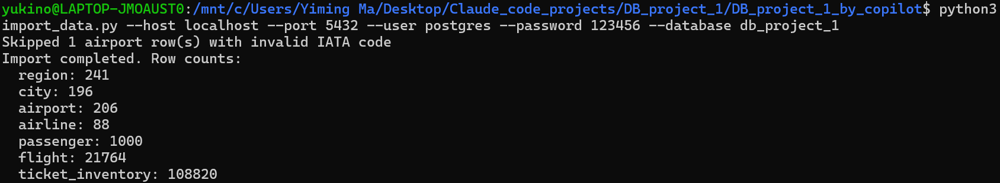
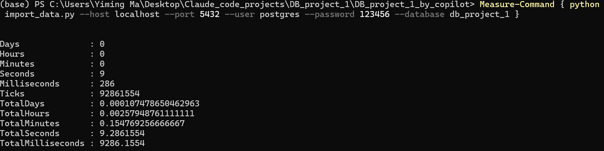
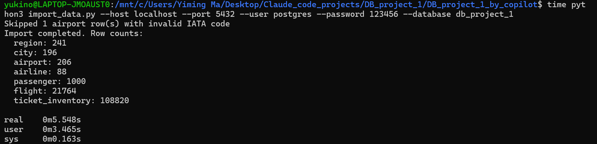
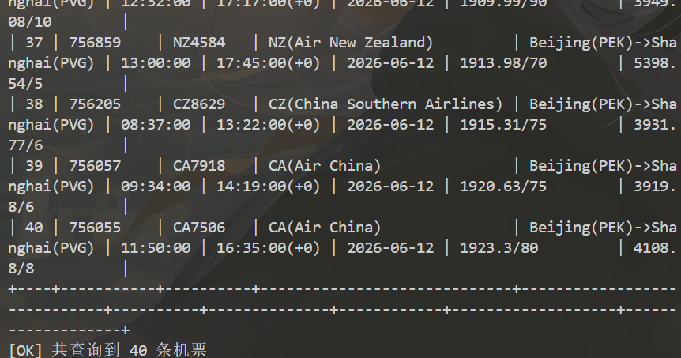
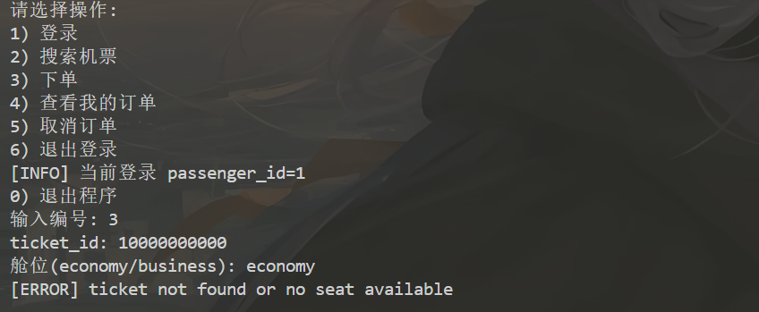
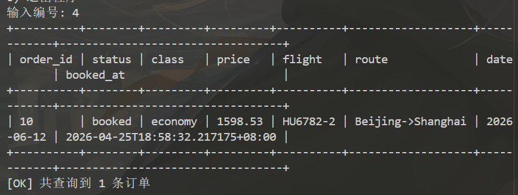
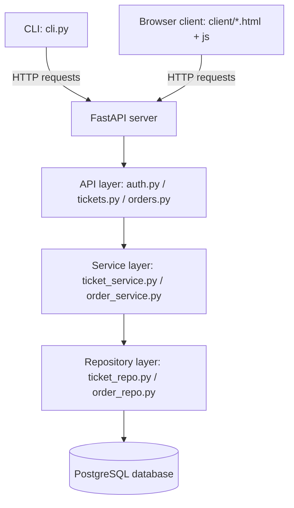

# CS307 Spring 2026 — Database Project Part 1 Report

---

## Basic Information of the Group

| Field | Member 1 | Member 2 |
|-------|----------|----------|
| **Name** | *马奕铭* | *李明龙* |
| **Student ID** | *12410614* | *12411830* |
| **Lab Session** | *Mon7,8* | *Mon7,8* |

### Contribution Breakdown

| Task / Part | Member 1  | Member 2  |
|---|---|---|
| Task 1 – E-R Diagram (`er_diagram.mmd`) | - | √ |
| Task 2 – Database Design (`schema.sql`) | √ | - |
| Task 3.1 – Import scripts (`import_data.py`) | √ | - |
| Task 3.2 – Accuracy SQL (`task3_accuracy_queries.sql`) | √ | - |
| Task 4 – CRUD CLI (`cli.py`) | - | √ |


---

## Task 1: E-R Diagram (20 %)

### Diagramming tool

TO BE DONE

### E-R Diagram

.png>)

### Entity and Relationship Overview

| Entity | Key Attributes | Role |
|--------|---------------|------|
| REGION | `region_code` (PK), `region_name` | Geographic region for cities and airlines |
| CITY | `city_id` (PK), `city_name`, `region_code` (FK) | City within a region |
| AIRPORT | `airport_id` (PK), `iata_code` (UK), `city_id` (FK) | Airport in a city |
| AIRLINE | `airline_id` (PK), `airline_code` (UK), `region_code` (FK) | Airline operating flights |
| PASSENGER | `passenger_id` (PK), `mobile_number` (UK) | Registered passenger |
| FLIGHT | `flight_id` (PK), `flight_number` (UK), `airline_id` (FK), source/destination airport FKs | A recurring flight route |
| TICKET_INVENTORY | `ticket_id` (PK), `flight_id` (FK), `flight_date` (UK per flight) | Daily ticket slot for a flight |
| TICKET_ORDER | `order_id` (PK), `passenger_id` (FK), `ticket_id` (FK) | A passenger's booking record |

Key relationships:
- REGION **contains** many CITYs; each CITY belongs to one REGION.  
- CITY **has** many AIRPORTs; each AIRPORT belongs to one CITY.  
- REGION **has** many AIRLINEs; each AIRLINE is registered in one REGION.  
- AIRLINE **operates** many FLIGHTs; each FLIGHT is operated by one AIRLINE.  
- AIRPORT participates in FLIGHT as both **departure** and **arrival** endpoint.  
- FLIGHT **schedules** many TICKET_INVENTORYs (one per date).  
- PASSENGER **places** many TICKET_ORDERs; each TICKET_ORDER references one TICKET_INVENTORY.

---

## Task 2: Database Design (20 %)

### DataGrip E-R Diagram


### Table Design

#### 2.1 `region`

Stores geographic regions sourced from `region.csv`, extended with extra entries derived from `airport.csv`, `airline.csv`, and `tickets.csv`.

| Column | Type | Constraints | Description |
|--------|------|-------------|-------------|
| `region_code` | `VARCHAR(8)` | PRIMARY KEY | Short identifier (e.g., `CN`, `US`, `TW`). Used as the canonical key across tables. |
| `region_name` | `TEXT` | NOT NULL, UNIQUE | Full human-readable name. |

**Design notes:** `region_code` is the natural key already present in the source data. Aliasing logic in `import_data.py` unifies synonyms such as `"Hong Kong SAR of China"` and `"DRAGON"` to `"Hong Kong"`, and `"UK"` to `"United Kingdom"`.

---

#### 2.2 `city`

Cities extracted from `airport.csv` and `tickets.csv`. A city is uniquely identified by its name within a region (composite unique constraint).

| Column | Type | Constraints | Description |
|--------|------|-------------|-------------|
| `city_id` | `BIGSERIAL` | PRIMARY KEY | Auto-generated surrogate key. |
| `city_name` | `TEXT` | NOT NULL | Name of the city. |
| `region_code` | `VARCHAR(8)` | NOT NULL, FK → `region` | Region the city belongs to. |

UNIQUE(`city_name`, `region_code`) — handles cities with the same name in different regions.

---

#### 2.3 `airport`

Airport data from `airport.csv`, plus synthetic entries for any IATA codes that appear in `tickets.csv` but not in `airport.csv`.

| Column | Type | Constraints | Description |
|--------|------|-------------|-------------|
| `airport_id` | `BIGSERIAL` | PRIMARY KEY | Surrogate key. |
| `source_airport_id` | `BIGINT` | UNIQUE | Original ID from the source CSV (nullable for synthetic rows). |
| `airport_name` | `TEXT` | NOT NULL | Full airport name. |
| `iata_code` | `CHAR(3)` | NOT NULL, UNIQUE | IATA 3-letter code; used as the natural identifier in queries. |
| `city_id` | `BIGINT` | NOT NULL, FK → `city` | City this airport belongs to. |
| `latitude` | `DOUBLE PRECISION` | — | Geographic latitude. |
| `longitude` | `DOUBLE PRECISION` | — | Geographic longitude. |
| `altitude` | `INTEGER` | — | Elevation in feet. |
| `timezone_offset` | `INTEGER` | — | UTC offset in hours. |
| `timezone_dst` | `VARCHAR(8)` | — | DST rule identifier. |
| `timezone_region` | `TEXT` | — | IANA timezone name. |

An index on `iata_code` supports fast lookups in join-heavy queries.

---

#### 2.4 `airline`

Airline data from `airline.csv`.

| Column | Type | Constraints | Description |
|--------|------|-------------|-------------|
| `airline_id` | `BIGSERIAL` | PRIMARY KEY | Surrogate key. |
| `source_airline_id` | `BIGINT` | UNIQUE | Original CSV ID. |
| `airline_code` | `VARCHAR(8)` | NOT NULL, UNIQUE | IATA or ICAO airline designator. |
| `airline_name` | `TEXT` | NOT NULL | Full airline name. |
| `region_code` | `VARCHAR(8)` | NOT NULL, FK → `region` | Region where the airline is registered. |

---

#### 2.5 `passenger`

Passenger data from `passenger.csv`.

| Column | Type | Constraints | Description |
|--------|------|-------------|-------------|
| `passenger_id` | `BIGSERIAL` | PRIMARY KEY | Surrogate key. |
| `source_passenger_id` | `BIGINT` | UNIQUE | Original CSV ID. |
| `passenger_name` | `TEXT` | NOT NULL | Full name. |
| `age` | `INTEGER` | CHECK (age >= 0) | Age in years. |
| `gender` | `VARCHAR(16)` | — | Gender string. |
| `mobile_number` | `VARCHAR(32)` | UNIQUE | Contact number; also serves as a natural key. |

---

#### 2.6 `flight`

Represents a recurring flight route (same schedule every day it operates). Split out from `tickets.csv`.

| Column | Type | Constraints | Description |
|--------|------|-------------|-------------|
| `flight_id` | `BIGSERIAL` | PRIMARY KEY | Surrogate key. |
| `flight_number` | `VARCHAR(16)` | NOT NULL, UNIQUE | Carrier + number (e.g., `AZ610`). |
| `airline_id` | `BIGINT` | NOT NULL, FK → `airline` | Operating airline. |
| `source_airport_id` | `BIGINT` | NOT NULL, FK → `airport` | Departure airport. |
| `destination_airport_id` | `BIGINT` | NOT NULL, FK → `airport` | Arrival airport. |
| `departure_time_local` | `TIME` | NOT NULL | Scheduled departure (local time). |
| `arrival_time_local` | `TIME` | NOT NULL | Scheduled arrival (local time). |
| `arrival_day_offset` | `SMALLINT` | NOT NULL, DEFAULT 0 | `0` = same day, `1` = next day. |
| `business_capacity` | `INTEGER` | NOT NULL, CHECK ≥ 0 | Total business seats on this flight. |
| `economy_capacity` | `INTEGER` | NOT NULL, CHECK ≥ 0 | Total economy seats on this flight. |

A CHECK constraint ensures `source_airport_id <> destination_airport_id`.

**Design note for "arrive before 11:00" queries:** storing `arrival_day_offset` as a separate integer column keeps the schema in 1NF (no encoded composite value in the time field) while enabling efficient filter:

```sql
SELECT * FROM flight
WHERE arrival_day_offset = 0
  AND arrival_time_local < '11:00:00';
```

A composite index `(arrival_time_local, arrival_day_offset)` makes this query fast even on large tables.

---

#### 2.7 `ticket_inventory`

One row per (flight, date) pair. Split from the original flat `tickets.csv`.

| Column | Type | Constraints | Description |
|--------|------|-------------|-------------|
| `ticket_id` | `BIGSERIAL` | PRIMARY KEY | Surrogate key. |
| `flight_id` | `BIGINT` | NOT NULL, FK → `flight` | The flight this inventory belongs to. |
| `flight_date` | `DATE` | NOT NULL | The calendar date of the flight. |
| `business_price` | `NUMERIC(10,2)` | NOT NULL, CHECK ≥ 0 | Business class price. |
| `business_remain` | `INTEGER` | NOT NULL, CHECK ≥ 0 | Remaining business seats. |
| `economy_price` | `NUMERIC(10,2)` | NOT NULL, CHECK ≥ 0 | Economy class price. |
| `economy_remain` | `INTEGER` | NOT NULL, CHECK ≥ 0 | Remaining economy seats. |

UNIQUE(`flight_id`, `flight_date`) prevents duplicate inventory rows.

---

#### 2.8 `ticket_order`

Records every booking or cancellation made by a passenger.

| Column | Type | Constraints | Description |
|--------|------|-------------|-------------|
| `order_id` | `BIGSERIAL` | PRIMARY KEY | Surrogate key. |
| `passenger_id` | `BIGINT` | NOT NULL, FK → `passenger` | The passenger who booked. |
| `ticket_id` | `BIGINT` | NOT NULL, FK → `ticket_inventory` | The ticket (flight+date) booked. |
| `cabin_class` | `VARCHAR(16)` | NOT NULL, CHECK IN ('economy','business') | Chosen cabin. |
| `unit_price` | `NUMERIC(10,2)` | NOT NULL, CHECK ≥ 0 | Price locked in at booking time. |
| `booked_at` | `TIMESTAMPTZ` | NOT NULL, DEFAULT NOW() | Booking timestamp (auto-set). |
| `status` | `VARCHAR(16)` | NOT NULL, DEFAULT 'booked', CHECK IN ('booked','cancelled') | Current order state. |

### Normal Form Analysis

- **1NF:** Every column stores a single atomic value. `arrival_day_offset` stores the day rollover as a plain integer rather than encoding it inside the time string.  
- **2NF:** All non-key attributes depend on the entire primary key. Tables with composite unique keys (e.g., `city`) use a surrogate PK to simplify FK references.  
- **3NF:** No transitive dependencies. For example, airport location data (latitude, longitude, etc.) lives in `airport`, not in `flight` or `ticket_inventory`.

### Indexes

| Index | Columns | Purpose |
|-------|---------|---------|
| `idx_airport_iata_code` | `airport(iata_code)` | Fast IATA lookups |
| `idx_city_name` | `city(city_name)` | City-name filter in ticket search |
| `idx_airline_code` | `airline(airline_code)` | Airline code/name filter |
| `idx_ticket_flight_date` | `ticket_inventory(flight_date)` | Date-based ticket queries |
| `idx_ticket_arrival_lookup` | `flight(arrival_time_local, arrival_day_offset)` | Efficient "arrive before X" filter |
| `idx_order_passenger_status` | `ticket_order(passenger_id, status)` | Per-passenger order lookups |

> **Attachment:** `schema.sql` contains all `CREATE TABLE` DDL statements.

---

## Task 3: Data Import (30 %)

### Task 3.1 — Script Description (5 %)

#### Scripts submitted

| Script name | Description |
|---|---|
| `import_data.py`| Single Python script that reads all five CSV files from the `Archive/` directory and imports them into PostgreSQL in the correct dependency order. Also applies `schema.sql` before importing. |
| `schema.sql` | DDL file executed by `import_data.py` to create tables and indexes before any data is inserted. |

#### How to run the import

**Prerequisites**

1. PostgreSQL running (tested on version 14+).  
2. Python 3.9+ with the `psycopg2` package installed (`pip install -r requirements.txt`).  
3. CSV files present in `Archive/` (airline.csv, airport.csv, passenger.csv, region.csv, tickets.csv).

**Steps**

```
Step 1 — Create the target database (run once):
  cd C:\PostgreSQL\bin
  .\psql -U postgres -c "CREATE DATABASE db_project_1;"

Step 2 — Run the import script:
  cd "C:\Users\Yiming Ma\Desktop\Claude_code_projects\DB_project_1\DB_project_1_by_copilot"
  python import_data.py --host localhost --port 5432 --user postgres --password 123456 --database db_project_1

Step 3 — Verify output:
  The script prints row counts for every table after import, for example:
    Import completed. Row counts:
      region:           XX
      city:             XX
      airport:          XX
      airline:          XX
      passenger:        XX
      flight:           XX
      ticket_inventory: XX
```

#### Import logic

The script processes tables in dependency order to satisfy all foreign-key constraints:

1. **Region codes** (`build_region_codes`) — Merges codes from `region.csv` with regions appearing in the other CSVs. Duplicate/alias region names are normalised (e.g., `"Hong Kong SAR of China"` → `"Hong Kong"`).  
2. **Regions** (`upsert_region`) — Bulk-insert with `ON CONFLICT UPDATE`.  
3. **Cities** (`upsert_cities`) — Derived from `airport.csv` and `tickets.csv`; inserted with `ON CONFLICT DO NOTHING` on the `(city_name, region_code)` unique constraint.  
4. **Airports** (`upsert_airports`) — Inserted from `airport.csv`; airports referenced in tickets but missing from the CSV are synthesised with the `"{city} {iata} Airport"` name pattern.  
5. **Airlines** (`upsert_airlines`) — From `airline.csv`, matched to region codes.  
6. **Passengers** (`upsert_passengers`) — From `passenger.csv`.  
7. **Flights & ticket inventory** (`upsert_flights_and_tickets`) — Flight rows are deduplicated by flight number; `arrival_day_offset` is parsed from the `(+1)` suffix in arrival time strings. Ticket inventory rows are deduplicated on `(flight_id, flight_date)`.

#### Dirty data handling

- Arrival times encoded as `HH:MM(+1)` are split into a time value and an integer offset field, satisfying 1NF.  
- Duplicate region names with different encodings are unified via the `REGION_ALIAS` dictionary.  
- Airport IATA codes with length ≠ 3 are discarded.  
- Seats remaining are taken as the maximum value observed across all ticket rows for a given flight, ensuring capacity is not under-estimated.

---

### Task 3.2 — Data Accuracy Checking (15 %)

The following queries are stored in `task3_accuracy_queries.sql` and can be run directly in DataGrip by substituting the named parameters.

#### Query 1 — Given a region code, list all cities

```sql
SELECT c.city_name
FROM city c
WHERE c.region_code = :region_code
ORDER BY c.city_name;
```

**Example:** `:region_code = 'CN'`

---

#### Query 2 — Given a city name, list all airports and IATA codes

```sql
SELECT a.airport_name, a.iata_code
FROM airport a
JOIN city c ON c.city_id = a.city_id
WHERE c.city_name = :city_name
ORDER BY a.airport_name;
```

**Example:** `:city_name = 'Taipei'`

---

#### Query 3 — Given a region code, list all airlines (code + name)

```sql
SELECT al.airline_code, al.airline_name
FROM airline al
WHERE al.region_code = :region_code
ORDER BY al.airline_code;
```

**Example:** `:region_code = 'TW'`

---

#### Query 4 — Given departure and arrival IATA codes, list all flights

```sql
SELECT
    f.flight_number,
    src_city.city_name      AS source_city,
    src_region.region_name  AS source_region,
    dst_city.city_name      AS destination_city,
    dst_region.region_name  AS destination_region
FROM flight f
JOIN airport src_air    ON src_air.airport_id  = f.source_airport_id
JOIN city    src_city   ON src_city.city_id    = src_air.city_id
JOIN region  src_region ON src_region.region_code = src_city.region_code
JOIN airport dst_air    ON dst_air.airport_id  = f.destination_airport_id
JOIN city    dst_city   ON dst_city.city_id    = dst_air.city_id
JOIN region  dst_region ON dst_region.region_code = dst_city.region_code
WHERE src_air.iata_code = :source_iata_code
  AND dst_air.iata_code = :destination_iata_code
ORDER BY f.flight_number;
```

**Example:** `:source_iata_code = 'FCO'`, `:destination_iata_code = 'LTN'`

---

#### Query 5 — Given date + departure city + arrival city, list tickets ordered by economy price

```sql
SELECT
    f.departure_time_local              AS departure_time,
    f.arrival_time_local                AS arrive_time,
    f.arrival_day_offset,
    src_air.airport_name                AS departure_airport_name,
    dst_air.airport_name                AS arrival_airport_name,
    ti.economy_price
FROM ticket_inventory ti
JOIN flight   f        ON f.flight_id        = ti.flight_id
JOIN airport  src_air  ON src_air.airport_id = f.source_airport_id
JOIN city     src_city ON src_city.city_id   = src_air.city_id
JOIN airport  dst_air  ON dst_air.airport_id = f.destination_airport_id
JOIN city     dst_city ON dst_city.city_id   = dst_air.city_id
WHERE ti.flight_date      = :flight_date
  AND src_city.city_name  = :departure_city
  AND dst_city.city_name  = :arrival_city
ORDER BY ti.economy_price ASC;
```

**Example:** `:flight_date = '2026-04-10'`, `:departure_city = 'Rome'`, `:arrival_city = 'London'`

---

#### Query 6 — Continue Query 5 with departure-time-after and arrival-time-before filters

```sql
SELECT
    f.departure_time_local              AS departure_time,
    f.arrival_time_local                AS arrive_time,
    f.arrival_day_offset,
    src_air.airport_name                AS departure_airport_name,
    dst_air.airport_name                AS arrival_airport_name,
    ti.economy_price
FROM ticket_inventory ti
JOIN flight   f        ON f.flight_id        = ti.flight_id
JOIN airport  src_air  ON src_air.airport_id = f.source_airport_id
JOIN city     src_city ON src_city.city_id   = src_air.city_id
JOIN airport  dst_air  ON dst_air.airport_id = f.destination_airport_id
JOIN city     dst_city ON dst_city.city_id   = dst_air.city_id
WHERE ti.flight_date          = :flight_date
  AND src_city.city_name      = :departure_city
  AND dst_city.city_name      = :arrival_city
  AND f.departure_time_local  >= :departure_time_after
  AND f.arrival_day_offset    = 0
  AND f.arrival_time_local    <= :arrival_time_before
ORDER BY ti.economy_price ASC;
```

**Example:** `:departure_time_after = '08:00'`, `:arrival_time_before = '23:00'`

**Note on the "arrive before 11:00" case:** because arrival times that cross midnight are stored with `arrival_day_offset = 1`, adding the condition `arrival_day_offset = 0` ensures next-day arrivals are excluded before applying the time comparison. This is both correct and efficient because `idx_ticket_arrival_lookup` covers `(arrival_time_local, arrival_day_offset)`.

---

### Task 3.3 - Advanced Requirements (10 %)

This section reports the completion status of advanced requirements #2, #3, #4, and #5.

| Advanced requirement | Status | Evidence |
|---|---|---|
| #2 Cross-system import | Completed | The same import script was tested successfully on Windows 11 and WSL2/Linux. |
| #3 Other database / OpenGauss experiment | Not completed | OpenGauss was not installed or tested, so this report does not claim completion of this item. |
| #4 Different or larger data volumes | Completed | The largest input file, `tickets.csv`, contains 108820 rows, and all ticket rows were imported into `ticket_inventory`. |
| #5 Efficient import design | Completed | The import uses batch insertion, ticket-table splitting, deduplication before upsert, and measured runtime comparison. |

**Test environment.** The import was tested on Windows 11 64-bit with Python 3.10.13 and on
WSL2/Linux with Python 3.10.12. Both systems used the same source code and connected to the
PostgreSQL database through `psycopg2`. The WSL2 environment was:


The CSV input sizes were:

| CSV file | Rows |
|---|---:|
| `airline.csv` | 88 |
| `airport.csv` | 204 |
| `passenger.csv` | 1000 |
| `region.csv` | 261 |
| `tickets.csv` | 108820 |

**Procedure.** A clean database named `db_project_1` was created in PostgreSQL. Then the import was
executed from PowerShell:

```powershell
python import_data.py --host localhost --port 5432 --user postgres --password <password> --database db_project_1
```

The script first executes `schema.sql`, then imports the source tables in foreign-key dependency
order: `region`, `city`, `airport`, `airline`, `passenger`, `flight`, and `ticket_inventory`.
During import, one airport row with an invalid IATA code was skipped as dirty data.

**Result.** The successful import produced the following final table sizes:



**Efficiency design.** The import uses `psycopg2.extras.execute_values` for batch inserts instead of
inserting rows one by one. This reduces database round trips, which is especially important for
the 108820 ticket rows. The script also deduplicates ticket inventory by `(flight_id, flight_date)`
before bulk upsert, avoiding repeated conflict updates inside the same batch. The ticket table is
split into `flight` and `ticket_inventory`, so repeated route/schedule information is stored once in
`flight`, while date-specific price and remaining-seat information is stored in `ticket_inventory`.

**Cross-system and measured time cost.** The import time was measured on Windows from PowerShell
and on WSL2/Linux using the shell `time` command.

```powershell
Measure-Command { python import_data.py --host localhost --port 5432 --user postgres --password <password> --database db_project_1 }
```


```bash
time python3 import_data.py --host localhost --port 5432 --user postgres --password <password> --database db_project_1
```


| System | Python | Runtime | Result |
|---|---|---:|---|
| Windows 11 64-bit | Python 3.10.13 | 9.2861554 seconds | Success |
| WSL2/Linux | Python 3.10.12 | 5.548 seconds | Success |

The same import script ran successfully on both systems without source-code changes.

---

## Task 4: CRUD Operations via Program Access (30 %)

### Overview

The CRUD operations are implemented as a command-line client in `cli.py`. The CLI does not access PostgreSQL directly; instead, it sends HTTP requests to the FastAPI backend under `server/app`. The backend owns database transactions, validation, and seat-count updates, while the CLI provides both a menu-style interactive interface and direct subcommands for testing.

```bash
python cli.py [--base-url http://127.0.0.1:8000] [subcommand] [subcommand options]
```

If no subcommand is provided, `cli.py` starts the interactive menu automatically. The CLI stores the current login state in `.cli_session.json` and sends the passenger identity to the API through the `X-Passenger-Id` request header.

Before using the CLI, start the backend:

```bash
cd server
python -m uvicorn app.main:app --reload --host 127.0.0.1 --port 8000
```

Then start the menu:

```bash
python cli.py
```

The interactive menu displayed by the CLI contains:

```text
1) Login
2) Search tickets
3) Book ticket
4) View my orders
5) Cancel order
6) Logout
7) Admin function: generate tickets   # only shown after admin login
0) Exit program
```

This menu is the main command-line interaction written for the project. It guides the user through login, ticket search, optional quick booking from search results, order listing, cancellation, logout, and administrator ticket generation.

---

### 4.1 Generate Ticket Inventory (Basic Requirement 1)

Ticket generation is an administrator operation. The CLI first logs in with the administrator account, then calls `/api/v1/tickets/generate`.

**Command-line mode:**

```bash
python cli.py login --mobile-number checker --password 114514
python cli.py generate --start-date 2026-04-10 --end-date 2026-04-16
```

**Interactive mode:**

```text
python cli.py
# choose 1) Login
# username: checker
# password: 114514
# choose 7) Admin function: generate tickets
# enter start date and end date
```

**What it does:**

1. `cli.py` sends a POST request to `/api/v1/tickets/generate` with `start_date` and `end_date`.
2. `auth.require_admin` checks that the saved session is the administrator session.
3. `TicketService.generate_inventory()` calls `TicketRepository.generate_inventory()`.
4. The repository inserts missing `(flight_id, flight_date)` inventory rows and skips duplicates.
5. The CLI prints the number of newly added rows.

**Sample output:**

```text
[OK] auto generated ticket inventory, added=1234（need check）
```


---

### 4.2 Search Tickets (Basic Requirement 2)

**Command-line mode:**

```bash
python cli.py search \
  --departure-city Rome --arrival-city London --date 2026-04-10
```

**With optional filters:**

```bash
python cli.py search \
  --departure-city Rome --arrival-city London --date 2026-04-10 \
  --airline AZ --departure-time 08:00 --arrival-time 23:00
```

**Interactive mode:**

```text
python cli.py
2) Search tickets
departure city: Rome
arrival city: London
date: 2026-04-10
airline: AZ
departure time lower bound: 08:00
arrival time upper bound: 23:00
```

**Required fields:** `--departure-city`, `--arrival-city`, `--date`  
**Optional fields:** `--airline` (code or name), `--departure-time` (after), `--arrival-time` (before, same day)

The CLI calls `/api/v1/tickets/search`. Results are printed as an aligned table:

```text
+-----------+--------+----------------+----------------------+----------+----------+------------+-------------------+-------------------+
| ticket_id | flight | airline        | route                | dep_time | arr_time | date       | eco(price/remain) | biz(price/remain) |
+-----------+--------+----------------+----------------------+----------+----------+------------+-------------------+-------------------+
```



---

### 4.3 Book a Ticket (Basic Requirement 3)

Booking requires a passenger login. The passenger can either pass `--passenger-id` explicitly or log in once and let the CLI read the saved passenger id from `.cli_session.json`.

**Command-line mode:**

```bash
python cli.py login --mobile-number <passenger_mobile_number> --password <password>
python cli.py book --ticket-id 100 --cabin-class economy
```

The old explicit style is also supported:

```bash
python cli.py book --passenger-id 1 --ticket-id 100 --cabin-class economy
```

**Interactive quick-book mode:**

```text
python cli.py
1) Login
2) Search tickets
whether to book directly? y
input result number
input cabin class: economy
```

**What it does:**

1. `cli.py` sends a POST request to `/api/v1/orders/book`.
2. The backend verifies the login state from `X-Passenger-Id`.
3. `OrderService.book_order()` checks passenger existence.
4. `OrderRepository.decrement_seat_and_get_price()` atomically decrements `economy_remain` or `business_remain`.
5. `OrderRepository.create_order()` inserts a row into `ticket_order`.
6. The CLI prints `order_id` and `booked_at`.

If the ticket does not exist or no seat is available, the API returns an error and the CLI prints it with the `[ERROR]` prefix.



---

### 4.4 List Orders (Basic Requirement 4a)

**Command-line mode:**

```bash
python cli.py orders
```

or:

```bash
python cli.py orders --passenger-id 1
```

**Interactive mode:**

```text
python cli.py
4) View my orders
```

The CLI calls `/api/v1/orders/{passenger_id}` and prints both booked and cancelled orders as a table:

```text
+----------+-----------+---------+--------+--------+--------------+------------+---------------------+
| order_id | status    | class   | price  | flight | route        | date       | booked_at           |
+----------+-----------+---------+--------+--------+--------------+------------+---------------------+
```



---

### 4.5 Cancel an Order (Basic Requirement 4b)

**Command-line mode:**

```bash
python cli.py cancel --order-id 10
```

or:

```bash
python cli.py cancel --passenger-id 1 --order-id 10
```

**Interactive mode:**

```text
python cli.py
5) Cancel order
order_id: 10
```

Before cancellation, the CLI displays the current passenger's order table so the user can confirm the target `order_id`. Then it calls `/api/v1/orders/{passenger_id}/{order_id}/cancel`.

**What it does:**

1. The backend verifies that the path `passenger_id` matches the logged-in passenger.
2. `OrderRepository.get_order_for_update()` locks the order row and checks that it is not already cancelled.
3. `OrderRepository.mark_cancelled()` sets `status = 'cancelled'`.
4. `OrderRepository.increment_seat()` restores the corresponding seat count in `ticket_inventory`.
5. The CLI prints the cancelled `order_id` and final status.

> *Attach a screenshot of this command running in your terminal.*

---

### 4.6 Login and Logout

The CLI includes login/logout commands because the API protects passenger order operations and administrator ticket generation.

```bash
python cli.py login --mobile-number <passenger_mobile_number> --password <password>
python cli.py logout
```

For the administrator:

```bash
python cli.py login --mobile-number checker --password 114514
```

`login` calls `/api/v1/auth/login`; a successful login writes `.cli_session.json`. `logout` removes this file.

---

### 4.7 Advanced Features Implemented

| Feature | Details |
|---------|---------|
| Interactive command-line menu | Running `python cli.py` opens a numbered menu for login, search, booking, order query, cancellation, logout, and admin generation |
| Session-based CLI workflow | `.cli_session.json` stores the logged-in passenger id, so repeated operations do not require retyping `--passenger-id` |
| API-based program access | The CLI calls FastAPI endpoints instead of duplicating SQL logic, keeping business rules in the backend |
| Atomic booking with seat decrement | `OrderRepository.decrement_seat_and_get_price()` updates inventory only when seats are available |
| Soft cancellation with seat restoration | `cancel_order()` marks `status='cancelled'` and restores the corresponding cabin inventory |
| Admin-only generation | `/api/v1/tickets/generate` requires the special administrator session |

---

## Code Architecture

The actual project is organized as a small full-stack system plus data-import scripts:

```text
DB_project_1/
├── schema.sql                         # PostgreSQL table definitions, constraints, and indexes
├── import_data.py                     # Builds schema and imports CSV files from Archive/
├── cli.py                             # Command-line client for login, ticket search, booking, orders, cancellation, and admin generation
├── task3_accuracy_queries.sql         # Required Task 3.2 SQL queries
├── Archive/                           # Source CSV files
├── server/
│   ├── app/main.py                    # FastAPI application entry point
│   ├── app/api/v1/router.py           # Combines API routers
│   ├── app/api/v1/auth.py             # Login and admin/passenger identity checks
│   ├── app/api/v1/tickets.py          # Ticket inventory and search endpoints
│   ├── app/api/v1/orders.py           # Booking, order listing, and cancellation endpoints
│   ├── app/core/config.py             # Configuration loading
│   ├── app/core/db.py                 # PostgreSQL connection dependency
│   ├── app/models/schemas.py          # Pydantic request/response schemas
│   ├── app/repository/ticket_repo.py  # SQL for ticket inventory and search
│   ├── app/repository/order_repo.py   # SQL for booking and order cancellation
│   ├── app/services/ticket_service.py # Ticket business logic
│   ├── app/services/order_service.py  # Order business logic
│   └── tests/test_api.py              # Backend API tests
└── client/
    ├── index.html, login.html, flights.html, inventory.html, orders.html, ticket-select.html
    ├── js/api.js                      # Browser-side API wrapper
    ├── js/*.js                        # Page-specific frontend behavior
    ├── style.css                      # Shared static-page styles
    └── src/                           # React/TypeScript component version kept with the project
```

The runtime data flow is:



This structure separates interaction surfaces from business logic: the CLI and browser client only collect user input and display results; FastAPI performs authentication and request validation; services enforce booking/cancellation rules; repositories contain SQL and transaction-sensitive database updates.

---

## Attachments

The following files are submitted alongside this report:

```text
DB_project_1/
├── ER_diagram.png
├── ER-diagram by DataGrip.png
├── schema.sql
├── import_data.py
├── task3_accuracy_queries.sql
├── cli.py
├── server/
├── client/
└── Archive/
```

> **Submission reminder:** export this document to PDF, ensure screenshots are embedded, verify page count is between 10 and 16, and upload to the BB website before **23:55 on April 26, 2026 (Beijing Time, UTC+8)**.
